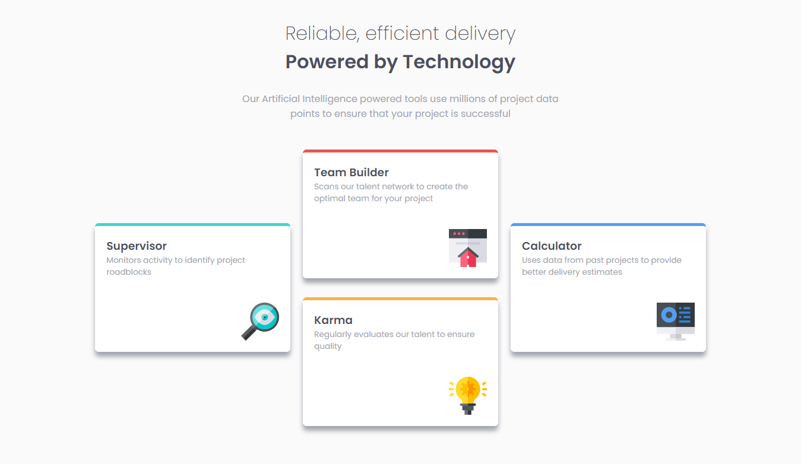

# Frontend Mentor - Four card feature section solution

This is a solution to the [Four card feature section challenge on Frontend Mentor](https://www.frontendmentor.io/challenges/four-card-feature-section-weK1eFYK). Frontend Mentor challenges help you improve your coding skills by building realistic projects.

## Table of contents

- [Overview](#overview)
  - [The challenge](#the-challenge)
  - [Final Work](#final-work)
  - [Links](#links)
- [My process](#my-process)
  - [Built with](#built-with)
  - [What I learned](#what-i-learned)
  - [Useful resources](#useful-resources)
- [Author](#author)

## Overview

### The challenge

Users should be able to:

- View the optimal layout for the site depending on their device's screen size

### Final Work



### Links

- Solution URL: [https://www.frontendmentor.io/solutions/fourcardfeaturesection-a-5miJj1s](https://www.frontendmentor.io/solutions/fourcardfeaturesection-a-5miJj1s)
- Live Site URL: [https://four-card-feature-section-eta-steel.vercel.app/](https://four-card-feature-section-eta-steel.vercel.app/)

## My process

### Built with

- Semantic HTML5 markup
- CSS custom properties
- Flexbox

### What I learned

Learnt how to add the `box-shadow` property to an element. Essentially the first unit caters for the horizontal axis, the second for the vertical, the third for the blur, and the last value being the color of the shadow.

```css
.card {
  background-color: #ffffff;
  padding: 1.2em;
  margin-bottom: 2em;
  border-radius: 0.4em;
  box-shadow: 0em 0.5em 0.5em var(--clr-nue-gb);
}
}
```

### Useful resources

- [Kevin Powel's CSS box shadow tutorial](https://www.youtube.com/watch?v=-JNRQ5HjNeI) - This helped me add the `box-shadow` feature to the 4 cards.

## Author

- LinkedIn - [Quartey-Papafio Nii Laryea](https://www.linkedin.com/in/nii-laryea-quartey-papafio-229440176/)
- Frontend Mentor - [@Pap-Ski](https://www.frontendmentor.io/profile/Pap-Ski)
